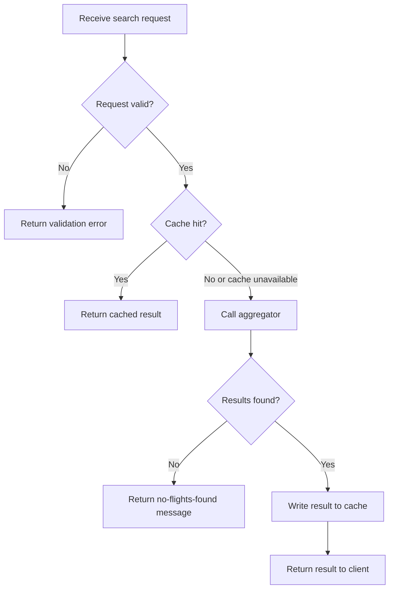
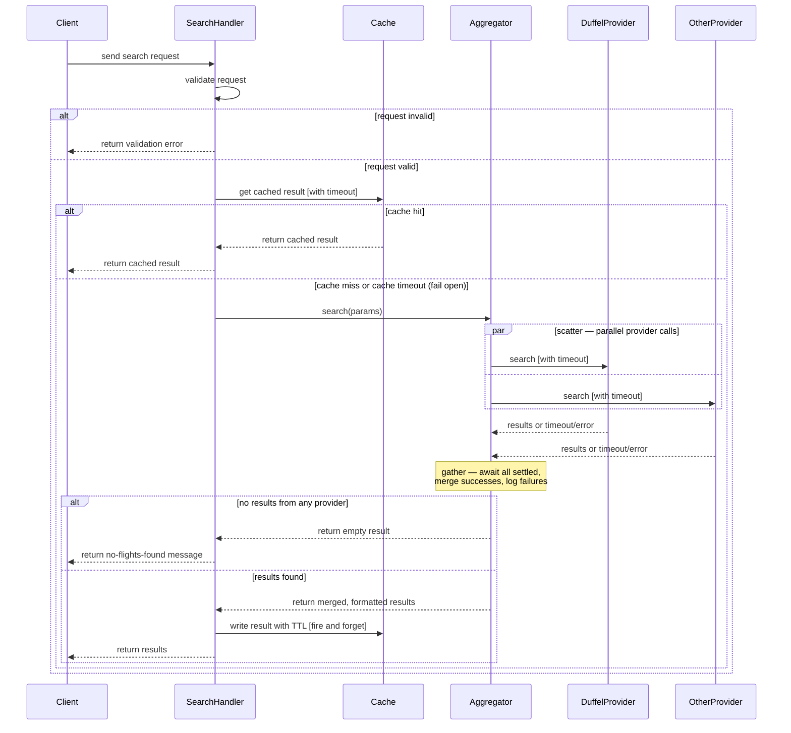

# Search flights guide

This file walks through the Duffel search payload, then covers the use case, flowchart, sequence diagram, and pseudocode for the Search Flights feature.

> **Note:** This is a first-pass version of the Search Flights spec, meant as a working example rather than a final design. The payload shown here is based on Duffel's basic documentation and should be treated as a proof of concept — the actual request/response shape may need to change depending on Duffel's current API docs, and will likely need enhancement once other providers are integrated, since each may structure search requests differently.

## How to search for flights?

To build the payload you'll need the flight itinerary - which should include the origins, destinations and departure dates and information about the passengers. Take a look at the next payload.

```json
{
  "data": {
    "slices": [
      {
        "origin": "NYC",
        "destination": "ATL",
        "departure_date": "2026-08-20"
      },
      {
        "origin": "ATL",
        "destination": "NYC",
        "departure_date": "2026-08-21"
      }
    ],
    "passengers": [
      {
        "type": "adult"
      },
      {
        "type": "adult"
      },
      {
        "age": 1
      }
    ],
    "cabin_class": "business"
  }
}
```

### Slices

As discussed in [Domain file](./../DOMAIN-EXPLAINED.md) it represents a journey that the passengers want to make between a particular origin and a particular destination on a particular date. and as above we just provided the `International Air Transport Association (IATA)` code for the airport (for example ATL for Atlanta's Hartsfield-Jackson International Airport) or for a city etc.. in our example we have two slices for `return trip`.

### Passengers

When searching we must provide the age of passengers aged under 18. For adults, we can just use `type: adult`.

> It is essential as airlines will charge different fares to passengers depending on their age.

### Response

An `id` for the offer request we just created. We may use this `ID` to retrieve the offer request later.
The response will include an array of `Offers`. We will get an offer request object containing our `Slices` and `Passengers` each passenger is given an `id` in order to be used when making a booking.

## Use Case: Search Flights

**Primary Actor:** User

**Precondition:** User has access to the search endpoint.

**Trigger:** User submits a flight search with origin, destination, dates, and passenger details.

**Main Success Scenario:**

1. User submits a search request.
2. System validates the request (dates, IATA codes, passenger ages, cabin class, other filters).
3. System checks the cache for a matching, unexpired result.
4. Cache hit — system returns the cached result to the user.

**Alternate Flows:**

- **A1 — Invalid request:** At step 2, if the request fails validation, the system returns a validation error and the flow ends.
- **A2 — Cache miss (or cache unavailable):** At step 3, if there is no cached result, or the cache itself times out or fails, the system proceeds as a cache miss:
  1. System calls the aggregator, which queries all configured providers (e.g. Duffel, others) in parallel.
  2. Each provider call is bound by its own timeout.
  3. System collects all provider responses, whether successful or failed, and merges the successful results.
  4. If at least one result is found, the system writes the merged result to the cache with a `Time To Live (TTL)`, then returns it to the user.
  5. If no provider returned any results, the system returns a no-flights-found message instead.
- **A3 — One or more providers fail or time out:** During step A2.1–A2.3, if a subset of providers fails or times out, the system proceeds with results from whichever providers succeeded rather than failing the entire search.

**Postcondition:** On a cache miss with results found, the cache is updated with the fresh result for subsequent identical searches.

### Flowchart



### Sequence diagram



### Pseudocode

```code
FUNCTION handleSearch(pathVariables, queryParameters)
    // ===== Validation — catch malformed requests before touching cache or providers =====
    validationError = validateSearchRequest(pathVariables, queryParameters)
    IF validationError IS NOT EMPTY THEN
        RETURN ERROR(validationError)
    END IF

    // Try the cache first, but don't let a slow/down cache block the whole search.
    // If the cache call times out or errors, treat it as a miss and fall through.
    cacheResult = TRY_WITH_TIMEOUT(cache.get(pathVariables, queryParameters), CACHE_TIMEOUT_MS)

    IF cacheResult IS NOT EMPTY THEN
        RETURN cacheResult
    END IF

    // Cache miss (or cache failure) — fetch fresh data from providers
    result = aggregator.search(pathVariables, queryParameters)

    IF result IS EMPTY THEN
        RETURN MESSAGE("We could not find flights for the specified date.")
    END IF

    // Write the fresh result back to cache with a TTL so stale offers expire on their own.
    // Fire-and-forget: do not make the client wait on this write.
    cache.setIfAbsent(result, CACHE_TTL)

    RETURN result
END FUNCTION


// ===== Validation =====
// Cheap, local checks that catch a malformed request before it ever
// reaches a provider. Nothing here calls the cache or a provider.
FUNCTION validateSearchRequest(pathVariables, queryParameters)
    IF departureDate IS BEFORE today THEN
        RETURN "Departure date cannot be in the past."
    END IF

    IF isRoundTrip AND returnDate IS BEFORE departureDate THEN
        RETURN "Return date cannot be before the departure date."
    END IF

    IF origin IS NOT A VALID IATA CODE OR destination IS NOT A VALID IATA CODE THEN
        RETURN "Origin or destination is not a recognized airport/city code."
    END IF

    IF origin EQUALS destination THEN
        RETURN "Origin and destination cannot be the same."
    END IF

    FOR EACH passenger IN passengers
        IF passenger.age IS PROVIDED AND passenger.age >= 18 THEN
            RETURN "Passengers aged 18 or over should not be submitted with an age — use adult type instead."
        END IF
    END FOR

    IF cabinClass IS NOT ONE OF [economy, premium, business, first] THEN
        RETURN "Invalid cabin class."
    END IF

    RETURN EMPTY  // no errors — request is valid
END FUNCTION


// ===== Aggregator =====
// Holds a list of Provider abstractions (e.g. Duffel, others...). Each Provider
// implementation applies the Adapter pattern internally, so whatever it returns
// is already normalized to match our application's response format — the
// aggregator never deals with provider-specific shapes.
FUNCTION aggregator.search(pathVariables, queryParameters)
    pendingCalls = EMPTY LIST

    FOR EACH provider IN providers
        // Each provider call gets its own timeout so one slow provider
        // can never hold up the rest of the results.
        pendingCalls.ADD( TRY_WITH_TIMEOUT(provider.search(pathVariables, queryParameters), PROVIDER_TIMEOUT_MS) )
    END FOR

    // Wait for every call to finish — whether it succeeded or failed —
    // instead of failing the whole batch the moment one provider errors.
    settledResults = AWAIT_ALL_SETTLED(pendingCalls)

    finalData = EMPTY LIST

    FOR EACH settled IN settledResults
        IF settled.succeeded THEN
            finalData.ADD_ALL(settled.value)
        ELSE
            // Provider failed or timed out — log it and move on.
            // One bad provider should reduce results, never break the search.
            LOG(settled.error)
        END IF
    END FOR

    RETURN finalData
END FUNCTION
```
